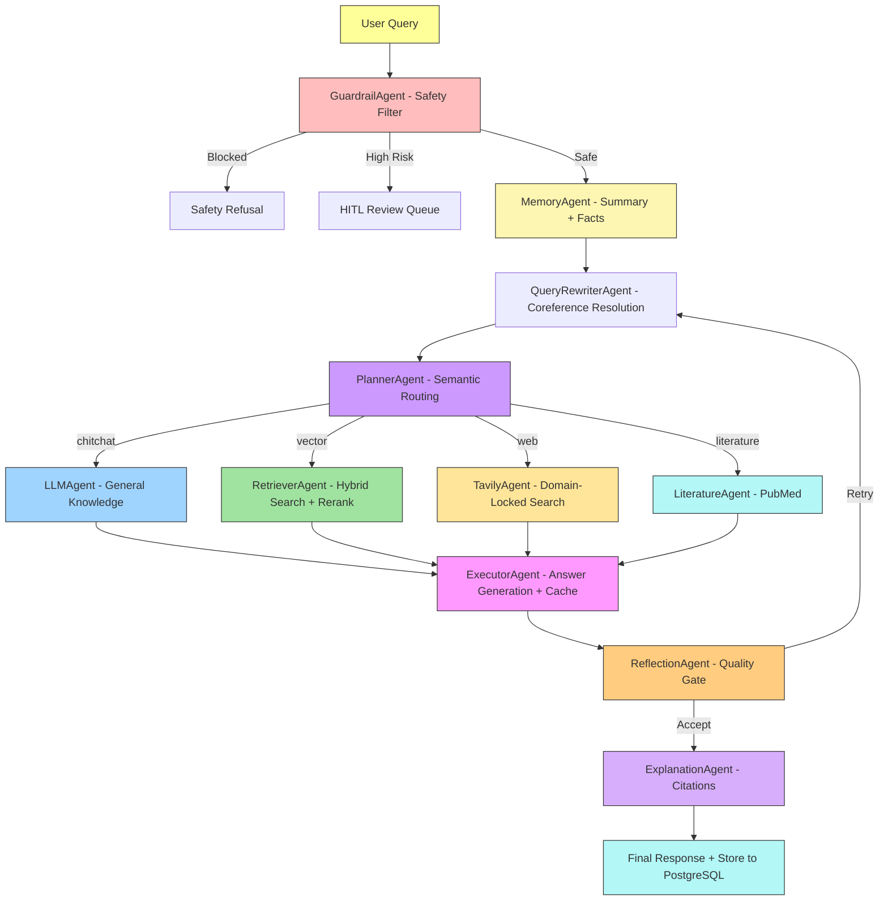

# **MediGenius: AI-Powered Multi-Agent Medical Assistant**

**MediGenius** is a **production-ready, multi-agent medical AI system** built with **LangGraph orchestration** and a FastAPI + PostgreSQL/pgvector runtime.

The system employs **Planner, Retriever, Answer Generator, Tool Router**, and **Fallback Handler Agents** that coordinate intelligently across diverse tools — combining, **medical RAG from verified PDFs**, and **fallback web searches** to ensure accuracy even when the LLM falters.

It features **PostgreSQL-powered long-term memory** for persistent medical conversation history and **pgvector** for medical knowledge retrieval. The full-stack implementation includes a **FastAPI + frontend** architecture with **Dockerized deployment**, integrated observability (Prometheus/Grafana), and CI evaluation gates for continuous quality checks.


[](https://github.com/user-attachments/assets/73828ab1-67aa-42d4-828f-6b2e1c72e429)

---

## **Live Demo**

You can interact with the live AI-powered medical assistant here:
-> [https://medigenius.onrender.com/](https://medigenius.onrender.com/)

---

## **Performance Evaluation & Benchmarking**

Previous benchmark numbers from the pre-upgrade architecture have been removed.
Current evaluation is CI-driven via `tests/eval/` and should be re-baselined on this FastAPI + PostgreSQL/pgvector stack before publishing comparative metrics.

---

## **Real-World Use Cases**

1. **Rural Health Access**
   Providing preliminary medical advice in rural or underserved areas where certified doctors may not be immediately available.

2. **Mental Health First Aid**
   Offering supportive conversations for users dealing with stress, anxiety, or medical confusion.

3. **Patient Pre-screening**
   Collecting and analyzing symptoms before a user visits a doctor, reducing clinical workload.

4. **Home Care Guidance**
   Guiding patients and caregivers on medication usage, symptoms, or recovery advice.

5. **Educational Assistant**
   Helping medical students or patients understand medical topics in simpler language.

---

## **Features**

* **Doctor-like medical assistant** with empathetic, patient-friendly communication and educational pivot
* **LLM-powered primary response** engine using Groq (LLaMA 3.3 70B) with OpenAI fallback
* **Advanced RAG pipeline** from indexed medical PDFs with hierarchical chunking, hybrid search (dense + BM25), and reranking
* **Semantic routing** via Planner Agent (chitchat, vector, web, literature routes)
* **Query rewriting** with coreference resolution for context-aware searches
* **Input guardrails** for safety filtering and HITL review on high-risk queries
* **Self-reflection node** for hallucination detection with bounded retries
* **Trusted-domain web search** (Tavily + Wikipedia + PubMed) filtered to NIH, Mayo Clinic, CDC, WHO
* **Vector database (pgvector)** with hybrid retrieval and cross-encoder reranking
* **Multi-agent orchestration** via LangGraph with Guardrail, Rewriter, Planner, Retriever, Executor, Reflection, and Explanation agents
* **PostgreSQL long-term memory** with summary buffer and user fact extraction
* **Semantic caching** for near-duplicate query optimization
* **Explainable AI citations** mapped to source documents with page/section references
* **SSE streaming** with real-time agent status updates in the UI
* **Human-in-the-loop (HITL)** approval gates for high-risk medical queries
* **Observability stack** with Prometheus metrics, Grafana dashboards, structured JSON logging, and OpenTelemetry tracing
* **Dockerized deployment** with `docker compose` (runtime stack by default, profile-gated eval service when needed)
* **FastAPI backend** with custom HTML, CSS, and JavaScript frontend
* **CI/CD pipeline** with lint, security audit, Docker build validation, and eval regression gates

---

## **Technical Stack**

| **Category**               | **Technology/Resource**                                                                                   |
|----------------------------|----------------------------------------------------------------------------------------------------------|
| **Core Framework**         | LangChain, LangGraph                                                                                      |
| **Multi-Agent Orchestration** | Guardrail, Query Rewriter, Planner, Memory, Retriever, LLM, Literature (PubMed), Tavily, Wikipedia, Executor, Reflection, Explanation |
| **LLM Provider**           | Groq (LLaMA 3.3 70B), OpenAI (GPT-4o-mini fallback)                                                      |
| **Embeddings Model**       | Local sentence-transformers (`Alibaba-NLP/gte-base-en-v1.5`) with optional Gemini backup                |
| **Vector Database**        | PostgreSQL + pgvector (hybrid search)                                                                     |
| **Document Processing**    | Docling parser + structure-aware chunker (section-aware text and table chunks)                            |
| **Search Tools**           | Tavily (domain-locked), Wikipedia API, PubMed NCBI API                                                   |
| **Conversation Flow**      | LangGraph StateGraph with conditional routing, reflection loops, and HITL interrupts                      |
| **Medical Knowledge Base** | Domain-specific medical PDFs + Wikipedia + PubMed                                                        |
| **Backend**                | FastAPI (REST API + SSE streaming)                                                                       |
| **Frontend**               | Custom HTML, CSS, JavaScript (SPA with glass-morphism UI)                                                |
| **Database**               | PostgreSQL 16 with pgvector extension, SQLAlchemy ORM, Alembic migrations                                |
| **Caching**                | Semantic cache with cosine similarity (configurable threshold)                                            |
| **Observability**          | Prometheus metrics, Grafana dashboards, structured JSON logging, OpenTelemetry tracing                   |
| **Deployment**             | Docker + `docker compose` (app, PostgreSQL, Prometheus, Grafana, profile-gated eval service)             |
| **CI/CD**                  | GitHub Actions (ruff lint, pip-audit, Docker build validation)                                            |
| **Configuration**          | pydantic-settings + .env (centralized Settings class)                                                    |
| **Hosting**                | Render (with managed PostgreSQL)                                                                         |

---

## **Installation and Runbook**

### Local Python install

Canonical install contract:

- Runtime environments install from `pyproject.toml` with `python3 -m pip install .`
- RAG/eval environments install the extra parser/eval toolchain with `python3 -m pip install ".[eval,ingest]"`
- Compose services run the built image and mount only mutable data, cache, and eval output paths; they do not bind-mount source code into `/app`

Runtime only:

```bash
python3 -m pip install .
```

Runtime + dev tooling:

```bash
python3 -m pip install ".[dev]"
```

Runtime + RAG/eval tooling:

```bash
python3 -m pip install ".[eval,ingest]"
```

Full local tooling:

```bash
python3 -m pip install ".[dev,eval,ingest]"
```

### Docker runtime stack

Start the default runtime stack:

```bash
docker compose up -d
```

If your Docker installation uses the legacy binary, replace `docker compose` with `docker-compose`.

### Schema contract

- Alembic is the only schema authority. App startup, reindex, and eval preflight now refuse to run against an unmanaged or stale schema.
- The `document_chunks.embedding` column contract is `vector(768)`.
- `EMBEDDING_DIM` must remain `768`; conflicting values are rejected during settings load.

Apply migrations before starting the app or any RAG/eval job:

```bash
python3 -m alembic -c alembic.ini upgrade head
```

From the Docker app container:

```bash
docker compose exec -T app python3 -m alembic -c /app/alembic.ini upgrade head
```

Reindex the medical PDF into PostgreSQL/pgvector:

```bash
docker compose exec -w /app app python3 scripts/reindex_pdf.py
```

Indexing is an explicit operation. API startup does not auto-ingest the corpus.
The reindex command now prints explicit parse, chunk, embed, and index stage counts.
After code changes, rebuild the image before running the stack again.
If you apply the vector-dimension alignment migration to an existing database, reindex the corpus afterward so embeddings are regenerated at `vector(768)`.

### Eval workflow

Run the RAG runtime preflight before reindexing or live eval work:

```bash
python3 scripts/preflight_rag.py
```

The preflight now checks the live Alembic revision and the `document_chunks.embedding` vector type, not just package imports. It is a runtime diagnostic, not the frozen regression gate.
The live smoke path also invokes Alembic with the explicit in-container config path `/app/alembic.ini`.
The container runtime cache root is fixed to `/app/.cache/embeddings` inside compose services, even if your local `.env` uses a different host-side value for non-container runs.
On the first Docling-based ingest against an empty cache, the parser now bootstraps Docling layout/table artifacts into `/app/.cache/embeddings/docling_artifacts` before conversion starts.
If the installed Docling downloader stores the layout model in a nested snapshot directory, the bootstrap normalizes that snapshot into the root `docling_artifacts` directory that the runtime loader expects.

Run the minimal live Docker/runtime smoke path:

```bash
python3 scripts/run_live_runtime_smoke.py --dry-run
```

If your machine only supports the legacy compose binary:

```bash
python3 scripts/run_live_runtime_smoke.py --compose-bin docker-compose --dry-run
```

Run the non-blocking extended live shadow path:

```bash
python3 scripts/run_live_rag_shadow.py --compose-bin docker-compose
```

Run the required frozen regression suite:

```bash
python3 -m pytest tests/eval tests/rag tests/smoke -v
```

Run validation from the profile-gated eval service:

```bash
docker compose --profile eval run --rm eval python3 -m eval.validate --strict
```

Run workflow evaluation with semantic cache disabled by default:

```bash
python3 -m eval.workflow_eval
```

If you intentionally want cache behavior included in workflow eval, opt in explicitly:

```bash
python3 -m eval.workflow_eval --semantic-cache
```

Tier 3 synthetic RAGAS generation has been retired from the active eval workflow.
The curated benchmark now lives only at `eval/golden/v1/tier3_rag.jsonl`, and the
supported Tier 3 authoring path is the manual-seed tooling:

```text
eval/tier3_manual_seed_pdf_authoring.py
scripts/build_tier3_manual_seed_authoring_index.py
eval/golden/v1/tier3_manual_seed_authoring_index.jsonl
```

The retired synthetic generator, raw checkpoint, and smoke runner are frozen under:

```text
bin/legacy_tier3_ragas/
```

They are kept for history only and must not be wired back into the active eval path.
See [docs/evals/tier3-seed-control-audit.md](/home/tough/medical_chatbot/MediGenius/docs/evals/tier3-seed-control-audit.md)
for the current Tier 3 benchmark boundary.

Semantic cache is disabled by default in development/local/test/eval-style environments. To enable it outside production, set `SEMANTIC_CACHE_ENABLED=true` explicitly and bump `SEMANTIC_CACHE_VERSION` whenever you want to invalidate old cache entries after prompt or retrieval contract changes.

---

## **Folder Structure**

```
MediGenius/
├── .github/
│   └── workflows/
│       └── eval.yml                 # CI: lint, security, Docker build, tests, eval
│
├── agents/
│   ├── common.py                    # Node wrapper with metrics
│   ├── guardrail_agent.py           # Input safety filtering + HITL triggers
│   ├── query_rewriter_agent.py      # Coreference resolution and query expansion
│   ├── planner_agent.py             # Semantic routing (chitchat/vector/web/literature)
│   ├── memory_agent.py              # Summary buffer + user fact extraction
│   ├── retriever_agent.py           # Hybrid search (dense + BM25) with reranking
│   ├── llm_agent.py                 # Chitchat / general knowledge
│   ├── literature_agent.py          # PubMed NCBI search
│   ├── tavily_agent.py              # Domain-locked web search
│   ├── wikipedia_agent.py           # Wikipedia fallback
│   ├── executor_agent.py            # Answer generation with semantic cache
│   ├── reflection_agent.py          # Self-RAG quality validation
│   └── explanation_agent.py         # Citation extraction and attribution
│
├── alembic/
│   ├── env.py
│   └── versions/
│       ├── 0001_initial_schema.py
│       └── 0002_add_hitl_reviews.py
│
├── api/
│   ├── deps.py                      # FastAPI dependency injection
│   └── routes/
│       ├── chat.py                  # POST /api/chat, POST /api/chat/stream
│       ├── health.py                # Liveness, readiness, metrics
│       ├── history.py               # Session and message history
│       └── hitl.py                  # HITL pending reviews and decisions
│
├── core/
│   ├── contracts.py                 # Pydantic request/response models
│   ├── hitl.py                      # HITL review logic (DB-backed)
│   ├── langgraph_workflow.py        # LangGraph StateGraph orchestration
│   ├── settings.py                  # Centralized pydantic-settings config
│   ├── state.py                     # Compatibility shim → state_v2
│   ├── state_v2.py                  # AgentState TypedDict + helpers
│   └── workflow_service.py          # Workflow run/stream service wrapper
│
├── data/
│   └── medical_book.pdf             # Medical knowledge base
│
├── db/
│   ├── models.py                    # SQLAlchemy ORM models (pgvector-aware)
│   ├── repositories.py              # Chat + Vector repository pattern
│   └── session.py                   # Engine + session factory
│
├── grafana/
│   └── dashboards/
│       └── medigenius-dashboard.json
│
├── observability/
│   ├── logging.py                   # Structured JSON logging
│   ├── metrics.py                   # Prometheus counters and histograms
│   ├── middleware.py                # Request tracing middleware
│   └── tracing.py                   # OpenTelemetry (OTLP / console)
│
├── prometheus/
│   └── prometheus.yml
│
├── scripts/
│   ├── init_postgres.py
│   └── reindex_pdf.py
│
├── static/
│   ├── css/style.css
│   └── js/main.js
│
├── templates/
│   └── index.html
│
├── tests/
│   ├── test_app.py
│   └── eval/
│       ├── testset_medical.jsonl
│       ├── run_eval.py
│       └── test_eval_regression.py
│
├── tools/
│   ├── cache.py                     # Semantic cache with cosine similarity
│   ├── embedding_client.py          # HuggingFace embeddings with fallback
│   ├── llm_client.py                # Groq + OpenAI dual-provider client
│   ├── pdf_loader.py                # Hierarchical PDF chunking
│   ├── search_tools.py              # Wikipedia, Tavily, PubMed wrappers
│   └── vector_store.py              # Ingestion + hybrid search wrapper
│
├── .dockerignore
├── .env.example
├── .gitignore
├── alembic.ini
├── app.py                           # FastAPI application factory
├── docker-compose.yml               # Runtime stack + profile-gated eval service
├── Dockerfile
├── pyproject.toml
├── README.md
└── render.yaml
```

---

## **Project Architecture**



---

## **API Endpoints**

## Base URL
`http://localhost:8000`

## Endpoints

### POST /api/chat
Process a medical question and return AI response.

**Request:**
```http
POST /api/chat HTTP/1.1
Content-Type: application/json
Host: localhost:8000

{
  "message": "What are diabetes symptoms?",
  "conversation_id": "optional_existing_id"
}
```

**Response:**
```json
{
  "response": "Diabetes symptoms include increased thirst, frequent urination...",
  "source": "Medical Literature Database",
  "timestamp": "12:30 PM",
  "success": true,
  "trace_id": "uuid",
  "route": "vector",
  "citations": []
}
```

### POST /api/chat/stream
SSE streaming variant of the chat endpoint. Returns incremental agent status events followed by a final response event.

### GET /api/history
Get message history for the current session.

### GET /api/sessions
List all chat sessions with previews.

### GET /api/session/{id}
Load a specific session's messages.

### DELETE /api/session/{id}
Delete a session and all its messages.

### POST /api/clear
Clear the current conversation.

### POST /api/new-chat
Create a new chat session.

### GET /api/hitl/pending
List pending HITL reviews.

### POST /api/hitl/decision
Approve or reject a pending HITL review.

### GET /health/live
Liveness probe (always returns 200 if process is running).

### GET /health/ready
Readiness probe (checks database connectivity, returns 503 if degraded).

### GET /metrics
Prometheus-formatted metrics.

---

## **Future Improvements**

- Add voice input/output
- Add image upload for reports or prescriptions
- Add integration with real-time medical APIs (e.g., WebMD)
- Add user authentication & role-based chat memory

---

## **Developed By**

**Md Emon Hasan**  
**Email:** emon.mlengineer@gmail.com   
**WhatsApp:** [+8801834363533](https://wa.me/8801834363533)  
**GitHub:** [Md-Emon-Hasan](https://github.com/Md-Emon-Hasan)  
**LinkedIn:** [Md Emon Hasan](https://www.linkedin.com/in/md-emon-hasan-695483237/)  
**Facebook:** [Md Emon Hasan](https://www.facebook.com/mdemon.hasan2001/)

---

## License
MIT License. Free to use with credit.
