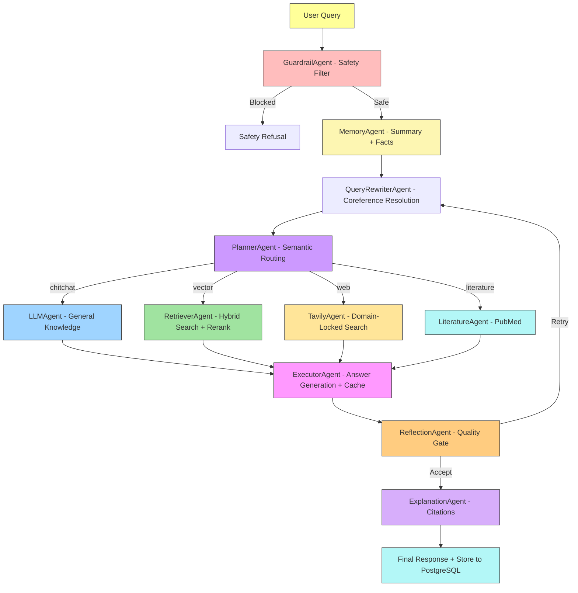

# **RealCare: AI-Powered Multi-Agent Medical Assistant**

**RealCare** is a **production-ready, multi-agent medical AI system** built with **LangGraph orchestration** and a FastAPI + PostgreSQL/pgvector runtime.

The system employs **Planner, Retriever, Answer Generator, Tool Router**, and **Fallback Handler Agents** that coordinate intelligently across diverse tools — combining, **medical RAG from verified PDFs**, and **fallback web searches** to ensure accuracy even when the LLM falters.

It features **PostgreSQL-powered long-term memory** for persistent medical conversation history and **pgvector** for medical knowledge retrieval. The full-stack implementation includes a **FastAPI + frontend** architecture with **Dockerized deployment**, integrated observability (Prometheus/Grafana), and CI evaluation gates for continuous quality checks.

---

## **Features**

* **Doctor-like medical assistant** with empathetic, patient-friendly communication and educational pivot
* **LLM-powered primary response** engine using Groq (LLaMA 3.3 70B) with OpenAI fallback
* **Advanced RAG pipeline** from indexed medical PDFs with hierarchical chunking, hybrid search (dense + BM25), and reranking
* **Semantic routing** via Planner Agent (chitchat, vector, web, literature routes)
* **Query rewriting** with coreference resolution for context-aware searches
* **Input guardrails** for safety filtering on dangerous queries
* **Self-reflection node** for hallucination detection with bounded retries
* **Trusted-domain web search** (Tavily + Wikipedia + PubMed) filtered to NIH, Mayo Clinic, CDC, WHO
* **Vector database (pgvector)** with hybrid retrieval and cross-encoder reranking
* **Multi-agent orchestration** via LangGraph with Guardrail, Rewriter, Planner, Retriever, Executor, Reflection, and Explanation agents
* **PostgreSQL long-term memory** with summary buffer and user fact extraction
* **Semantic caching** for near-duplicate query optimization
* **Explainable AI citations** mapped to source documents with page/section references
* **SSE streaming** with real-time agent status updates in the UI
* **Observability stack** with Prometheus metrics, Grafana dashboards, structured JSON logging, and OpenTelemetry tracing
* **Dockerized deployment** with `docker compose` (runtime stack by default, profile-gated eval service when needed)
* **FastAPI backend** with custom HTML, CSS, and JavaScript frontend
* **CI/CD pipeline** with lint, security audit, Docker build validation, and eval regression gates

---

## **Technical Stack**

| **Category**               | **Technology/Resource**                                                                                   |
|----------------------------|----------------------------------------------------------------------------------------------------------|
| **Core Framework**         | LangChain, LangGraph                                                                                      |
| **Multi-Agent Orchestration** | Guardrail, Query Rewriter, Planner, Memory, Retriever, LLM, Literature (PubMed), Tavily, Wikipedia, Executor, Reflection, Explanation |
| **LLM Provider**           | Groq (LLaMA 3.3 70B), OpenAI (GPT-4o-mini fallback)                                                      |
| **Embeddings Model**       | Local sentence-transformers (`Alibaba-NLP/gte-base-en-v1.5`) with optional Gemini backup                |
| **Vector Database**        | PostgreSQL + pgvector (hybrid search)                                                                     |
| **Document Processing**    | Docling parser + structure-aware chunker (section-aware text and table chunks)                            |
| **Search Tools**           | Tavily (domain-locked), Wikipedia API, PubMed NCBI API                                                   |
| **Conversation Flow**      | LangGraph StateGraph with conditional routing and reflection loops                                        |
| **Medical Knowledge Base** | Domain-specific medical PDFs + Wikipedia + PubMed                                                        |
| **Backend**                | FastAPI (REST API + SSE streaming)                                                                       |
| **Frontend**               | Custom HTML, CSS, JavaScript (SPA with glass-morphism UI)                                                |
| **Database**               | PostgreSQL 16 with pgvector extension, SQLAlchemy ORM, Alembic migrations                                |
| **Caching**                | Semantic cache with cosine similarity (configurable threshold)                                            |
| **Observability**          | Prometheus metrics, Grafana dashboards, structured JSON logging, OpenTelemetry tracing                   |
| **Deployment**             | Docker + `docker compose` (app, PostgreSQL, Prometheus, Grafana, profile-gated eval service)             |
| **CI/CD**                  | GitHub Actions (ruff lint, pip-audit, Docker build validation)                                            |
| **Configuration**          | pydantic-settings + .env (centralized Settings class)                                                    |
| **Hosting**                | Render (with managed PostgreSQL)                                                                         |

---

## **Project Architecture**



---

## **Folder Structure**

```
RealCare/
├── .github/
│   └── workflows/
│       └── eval.yml                 # CI: lint, security, Docker build, tests, eval
│
├── agents/
│   ├── common.py                    # Node wrapper with metrics
│   ├── guardrail_agent.py           # Input safety filtering
│   ├── query_rewriter_agent.py      # Coreference resolution and query expansion
│   ├── planner_agent.py             # Semantic routing (chitchat/vector/web/literature)
│   ├── memory_agent.py              # Summary buffer + user fact extraction
│   ├── retriever_agent.py           # Hybrid search (dense + BM25) with reranking
│   ├── llm_agent.py                 # Chitchat / general knowledge
│   ├── literature_agent.py          # PubMed NCBI search
│   ├── tavily_agent.py              # Domain-locked web search
│   ├── wikipedia_agent.py           # Wikipedia fallback
│   ├── executor_agent.py            # Answer generation with semantic cache
│   ├── reflection_agent.py          # Self-RAG quality validation
│   └── explanation_agent.py         # Citation extraction and attribution
│
├── alembic/
│   ├── env.py
│   └── versions/
│       ├── 0001_initial_schema.py
│       ├── 0002_add_hitl_reviews.py
│       ├── 0003_align_document_chunks_vector_contract.py
│       └── 0004_drop_hitl_reviews.py
│
├── api/
│   ├── deps.py                      # FastAPI dependency injection
│   └── routes/
│       ├── chat.py                  # POST /api/chat, POST /api/chat/stream
│       ├── health.py                # Liveness, readiness, metrics
│       └── history.py               # Session and message history
│
├── core/
│   ├── contracts.py                 # Pydantic request/response models
│   ├── langgraph_workflow.py        # LangGraph StateGraph orchestration
│   ├── settings.py                  # Centralized pydantic-settings config
│   ├── state.py                     # Compatibility shim → state_v2
│   ├── state_v2.py                  # AgentState TypedDict + helpers
│   └── workflow_service.py          # Workflow run/stream service wrapper
│
├── data/
│   └── medical_book.pdf             # Medical knowledge base
│
├── db/
│   ├── models.py                    # SQLAlchemy ORM models (pgvector-aware)
│   ├── repositories.py              # Chat + Vector repository pattern
│   └── session.py                   # Engine + session factory
│
├── grafana/
│   └── dashboards/
│       └── medigenius-dashboard.json
│
├── observability/
│   ├── logging.py                   # Structured JSON logging
│   ├── metrics.py                   # Prometheus counters and histograms
│   ├── middleware.py                # Request tracing middleware
│   └── tracing.py                   # OpenTelemetry (OTLP / console)
│
├── prometheus/
│   └── prometheus.yml
│
├── scripts/
│   ├── init_postgres.py
│   └── reindex_pdf.py
│
├── static/
│   ├── css/style.css
│   └── js/main.js
│
├── templates/
│   └── index.html
│
├── tests/
│   ├── test_app.py
│   └── eval/
│       ├── testset_medical.jsonl
│       ├── run_eval.py
│       └── test_eval_regression.py
│
├── tools/
│   ├── cache.py                     # Semantic cache with cosine similarity
│   ├── embedding_client.py          # HuggingFace embeddings with fallback
│   ├── llm_client.py                # Groq + OpenAI dual-provider client
│   ├── pdf_loader.py                # Hierarchical PDF chunking
│   ├── search_tools.py              # Wikipedia, Tavily, PubMed wrappers
│   └── vector_store.py              # Ingestion + hybrid search wrapper
│
├── .dockerignore
├── .env.example
├── .gitignore
├── alembic.ini
├── app.py                           # FastAPI application factory
├── docker-compose.yml               # Runtime stack + profile-gated eval service
├── Dockerfile
├── pyproject.toml
├── README.md
└── render.yaml
```

---

## **Installation**

### Quick start

Install the project:

```bash
python3 -m pip install .
```

If you want local dev, eval, and ingest tooling too:

```bash
python3 -m pip install ".[dev,eval,ingest]"
```

Start the runtime stack:

```bash
docker compose up -d
```

Apply migrations (local):

```bash
python3 -m alembic -c alembic.ini upgrade head
```

Apply migrations (Docker container):

```bash
python3 -m alembic -c /app/alembic.ini upgrade head
```

Reindex the corpus:

```bash
docker compose exec -w /app app python3 scripts/reindex_pdf.py
```

Run the core regression suite:

```bash
python3 -m pytest tests/eval tests/rag tests/smoke -v
```

### Notes

- Alembic is the only schema authority.
- `document_chunks.embedding` must stay `vector(768)`.
- API startup does not auto-ingest the corpus.
- Semantic cache is disabled by default in dev/test/eval-style environments.
- Tier 3 synthetic RAGAS generation is retired; use the manual-seed Tier 3 benchmark path instead.

### Optional checks

```bash
python3 scripts/preflight_rag.py
python3 scripts/run_live_runtime_smoke.py --dry-run
python3 -m eval.workflow_eval
docker compose --profile eval run --rm eval python3 -m eval.validate --strict
```

See [docs/evals/tier3-seed-control-audit.md](/home/tough/medical_chatbot/MediGenius/docs/evals/tier3-seed-control-audit.md)
for the current Tier 3 benchmark boundary.

---

## **API Endpoints**

Base URL: `http://localhost:8000`

### Core chat

- `POST /api/chat` — standard chat request/response
- `POST /api/chat/stream` — SSE streaming chat

Example request:

```json
{
  "message": "What are diabetes symptoms?",
  "conversation_id": "optional_existing_id"
}
```

### History and sessions

- `GET /api/history` — current session history
- `GET /api/sessions` — list saved sessions
- `GET /api/session/{id}` — load one session
- `DELETE /api/session/{id}` — delete one session
- `POST /api/clear` — clear current conversation
- `POST /api/new-chat` — create a new session

### Health

- `GET /health/live` — liveness probe
- `GET /health/ready` — readiness probe
- `GET /metrics` — Prometheus metrics

---

## **Installation**

### Runtime (default — no eval services)

```bash
python3 -m pip install .
docker-compose up
```

### Development and evaluation

```bash
python3 -m pip install ".[dev]"
python3 -m pip install ".[eval,ingest]"
```

### Live runtime smoke test

Verify the full stack is healthy after deployment:

```bash
python3 scripts/run_live_runtime_smoke.py --dry-run
python3 scripts/run_live_runtime_smoke.py --compose-bin docker-compose
```

---

## **Future Improvements**

- Add voice input/output
- Add image upload for reports or prescriptions
- Add integration with real-time medical APIs (e.g., WebMD)
- Add user authentication & role-based chat memory

---

## **Developed By**

**Jiachen ZHANG**  
**Email:** e1520372@u.nus.edu

---

## License
MIT License. Free to use with credit.
