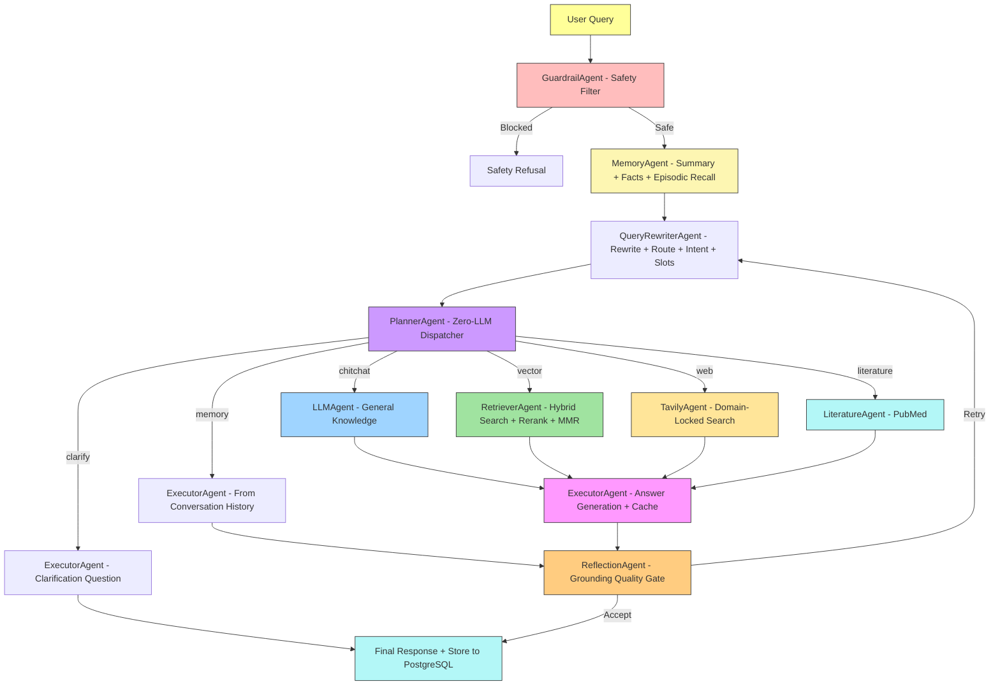

# **MediGenius: AI-Powered Multi-Agent Medical Assistant**

**MediGenius** is a **production-ready, multi-agent medical AI system** built with **LangGraph orchestration** and a FastAPI + PostgreSQL/pgvector runtime.

The system routes queries through **Guardrail, Memory, Query Rewriter, Planner, Retriever, Executor, and Reflection** agents that coordinate intelligently — combining **medical RAG from verified PDFs**, trusted web search, PubMed literature retrieval, and long-term user memory to produce grounded, cited answers.

---

## **Features**

* **Doctor-like medical assistant** with empathetic, patient-friendly communication
* **LLM-powered primary response** engine using Groq (LLaMA 3.3 70B) with OpenAI fallback
* **Advanced RAG pipeline** with hierarchical chunking, hybrid search (dense + BM25), cross-encoder reranking (Cohere or BM25 fallback), and MMR diversity filtering
* **Semantic routing** via unified Query Rewriter: chitchat, vector, web, literature, memory, and clarify routes
* **HITL proactive clarification** — low-confidence queries trigger a clarification request instead of guessing (controlled by `HITL_CLARIFICATION_CONFIDENCE_THRESHOLD`)
* **Input guardrails** for safety filtering on dangerous or off-scope queries
* **Self-reflection quality gate** with grounding-based hallucination detection (contradicts-chunks criterion) and bounded retries; skipped for chitchat/memory/clarify routes
* **Parent-child chunk hierarchy** (optional) — child chunks (~200 tokens) for retrieval precision, parent chunks (~800 tokens) for richer executor context
* **Adjacent chunk expansion** — executor fetches ±1 neighbor chunks within the same section for better context assembly
* **Trusted-domain web search** (Tavily + Wikipedia + PubMed) filtered to NIH, Mayo Clinic, CDC, WHO
* **Vector database (pgvector)** with hybrid dense + sparse (`tsvector` + `ts_rank`) retrieval
* **PostgreSQL long-term memory** — session summary buffer + user fact extraction + cross-session episodic memories via pgvector semantic recall
* **Redis working memory** — hot overlay (`recent_turns` + `core_state`) with PostgreSQL fallback
* **Semantic caching** for near-duplicate query optimization (version-aware, disabled in eval by default)
* **Structured citations** mapped to source documents with page/section references
* **SSE streaming** with real-time agent status updates in the UI
* **Full observability stack** — Prometheus metrics, Grafana dashboards, structured JSON logging, OpenTelemetry tracing (OTLP → Grafana Tempo), and per-message trace deeplinks in the UI
* **LLM-as-judge live RAGAS proxies** — post-response LLM scoring of answer relevance, groundedness, context precision, and context coverage; emitted to Prometheus/Grafana on every turn
* **Dockerized deployment** with `docker compose` (runtime stack by default, profile-gated eval service when needed)
* **FastAPI backend** with custom HTML/CSS/JavaScript frontend
* **CI/CD pipeline** with lint, security audit, Docker build validation, and eval regression gates

---

## **Technical Stack**

| **Category**                  | **Technology / Resource**                                                                                          |
|-------------------------------|-------------------------------------------------------------------------------------------------------------------|
| **Core Framework**            | LangChain, LangGraph                                                                                               |
| **Multi-Agent Orchestration** | Guardrail, Memory, Query Rewriter, Planner, Retriever, LLM, Literature (PubMed), Tavily, Wikipedia, Executor, Reflection |
| **LLM Provider**              | Groq (LLaMA 3.3 70B), OpenAI (GPT-4o-mini fallback)                                                              |
| **Embeddings Model**          | Local sentence-transformers (`Alibaba-NLP/gte-base-en-v1.5`), optional Gemini / OpenAI providers                 |
| **Vector Database**           | PostgreSQL + pgvector (hybrid dense + BM25 sparse search)                                                        |
| **Document Processing**       | Docling parser + structure-aware chunker (section-aware text and table chunks, optional parent-child hierarchy)   |
| **Reranking**                 | Cohere cross-encoder (with BM25 fallback) + MMR diversity filter                                                 |
| **Search Tools**              | Tavily (domain-locked), Wikipedia API, PubMed NCBI API                                                           |
| **Conversation Flow**         | LangGraph StateGraph with conditional routing, reflection loops, and clarification short-circuit                  |
| **Memory**                    | Redis working memory (hot) + PostgreSQL session memory (cold) + pgvector episodic cross-session memory            |
| **Backend**                   | FastAPI (REST API + SSE streaming)                                                                                |
| **Frontend**                  | Custom HTML, CSS, JavaScript (SPA with glass-morphism UI)                                                        |
| **Database**                  | PostgreSQL 16 with pgvector extension, SQLAlchemy ORM, Alembic migrations                                        |
| **Caching**                   | Semantic cache with cosine similarity (configurable threshold, version-aware)                                     |
| **Observability**             | Prometheus metrics, Grafana dashboards, structured JSON logging, OpenTelemetry + Grafana Tempo                    |
| **Live Eval Proxies**         | LLM-as-judge RAGAS proxies (answer relevance, groundedness, context precision, context coverage)                  |
| **Deployment**                | Docker + `docker compose` (app, PostgreSQL, Redis, Prometheus, Grafana, Tempo; profile-gated eval service)        |
| **CI/CD**                     | GitHub Actions (ruff lint, pip-audit, Docker build validation)                                                    |
| **Configuration**             | pydantic-settings + .env (centralized Settings class)                                                             |
| **Hosting**                   | Render (with managed PostgreSQL)                                                                                   |

---

## **Project Architecture**



---

## **Folder Structure**

```
MediGenius/
├── .github/
│   └── workflows/
│       └── eval.yml                 # CI: lint, security, Docker build, tests, eval
│
├── agents/
│   ├── common.py                    # Node wrapper with OTel spans and Prometheus metrics
│   ├── guardrail_agent.py           # Input safety filtering
│   ├── query_rewriter_agent.py      # Unified query understanding: rewrite, route, intent, slots
│   ├── planner_agent.py             # Zero-LLM dispatcher (reads route from rewriter state)
│   ├── memory_agent.py              # Summary buffer + user fact extraction + episodic recall
│   ├── retriever_agent.py           # Hybrid search (dense + BM25) with Cohere/BM25 reranking + MMR
│   ├── llm_agent.py                 # Chitchat / general knowledge (no retrieval)
│   ├── literature_agent.py          # PubMed NCBI search
│   ├── tavily_agent.py              # Domain-locked web search
│   ├── wikipedia_agent.py           # Wikipedia fallback
│   ├── executor_agent.py            # Answer generation with semantic cache and citation assembly
│   ├── reflection_agent.py          # Grounding-based quality gate with retry
│   └── decomposer_agent.py          # Compound query splitter (stubbed, disabled by default)
│
├── alembic/
│   ├── env.py
│   └── versions/
│       ├── 0001_initial_schema.py
│       ├── 0002_add_hitl_reviews.py
│       ├── 0003_align_document_chunks_vector_contract.py
│       ├── 0004_add_content_tsvector.py
│       ├── 0005_add_eval_run_tracking.py
│       ├── 0005_add_long_term_memory.py
│       └── 0007_drop_hitl_reviews.py
│
├── api/
│   ├── chat_runtime.py              # Working-memory loading and post-response side effects
│   ├── deps.py                      # FastAPI dependency injection
│   └── routes/
│       ├── chat.py                  # POST /api/chat, POST /api/chat/stream
│       ├── health.py                # Liveness, readiness, metrics
│       └── history.py               # Session and message history
│
├── core/
│   ├── contracts.py                 # Pydantic request/response models
│   ├── langgraph_workflow.py        # LangGraph StateGraph orchestration
│   ├── settings.py                  # Centralized pydantic-settings config
│   ├── state.py                     # Compatibility shim → state_v2
│   ├── state_v2.py                  # AgentState TypedDict + helpers
│   └── workflow_service.py          # Workflow run/stream service wrapper
│
├── data/
│   └── medical_book.pdf             # Medical knowledge base
│
├── db/
│   ├── models.py                    # SQLAlchemy ORM models (pgvector-aware)
│   ├── repositories.py              # Chat + Vector repository pattern
│   ├── schema_contract.py           # Vector dimension source of truth
│   └── session.py                   # Engine + session factory
│
├── docs/
│   ├── architecture/current-state.md
│   ├── decisions/                   # Architecture decision records (ADR-0001 … ADR-0007)
│   └── changes/implementation-log.md
│
├── grafana/
│   └── dashboards/
│       └── medigenius-dashboard.json
│
├── observability/
│   ├── live_judge.py                # Post-response LLM-as-judge RAGAS proxy scorer
│   ├── logging.py                   # Structured JSON logging
│   ├── metrics.py                   # Prometheus counters and histograms
│   ├── middleware.py                # Request tracing middleware
│   ├── tempo.yaml                   # Grafana Tempo OTel pipeline config
│   └── tracing.py                   # OpenTelemetry (OTLP / console)
│
├── prometheus/
│   └── prometheus.yml
│
├── scripts/
│   ├── init_postgres.py
│   ├── preflight_rag.py
│   ├── reindex_pdf.py
│   └── run_live_runtime_smoke.py
│
├── static/
│   ├── css/style.css
│   └── js/main.js
│
├── templates/
│   └── index.html
│
├── tests/
│   ├── agents/
│   ├── observability/
│   ├── rag/
│   ├── smoke/
│   └── tools/
│
├── tools/
│   ├── cache.py                     # Semantic cache with cosine similarity
│   ├── chunk_enrichment.py          # Optional LLM-based chunk context enrichment
│   ├── embedding_client.py          # HuggingFace / Gemini / OpenAI embedding client
│   ├── knn_router.py                # k-NN seed-based routing fallback
│   ├── llm_client.py                # Groq + OpenAI dual-provider client with OTel events
│   ├── pdf_chunker.py               # Structure-aware chunker (text + tables, parent-child)
│   ├── pdf_loader.py                # PDF load entry point
│   ├── pdf_parser.py                # Docling-based PDF parser
│   ├── search_tools.py              # Wikipedia, Tavily, PubMed wrappers
│   ├── vector_store.py              # Ingestion + hybrid search wrapper
│   ├── working_memory.py            # Redis working memory contract
│   └── working_memory_service.py    # Hot Redis overlay with PostgreSQL fallback
│
├── .dockerignore
├── .env.example
├── .gitignore
├── AGENTS.md                        # Project rules and working principles
├── TODOS.md                         # Deferred work items with context
├── alembic.ini
├── app.py                           # FastAPI application factory
├── docker-compose.yml               # Runtime stack + profile-gated eval service
├── Dockerfile
├── pyproject.toml
└── render.yaml
```

---

## **Installation**

### Quick start

Install the project:

```bash
python3 -m pip install .
```

If you want local dev, eval, and ingest tooling too:

```bash
python3 -m pip install ".[dev,eval,ingest]"
```

Start the runtime stack:

```bash
docker-compose up -d
```

Apply migrations (Docker container):

```bash
docker-compose exec -w /app app python3 -m alembic -c /app/alembic.ini upgrade head
```

Reindex the corpus:

```bash
docker-compose exec -w /app app python3 scripts/reindex_pdf.py
```

Run the core regression suite:

```bash
python3 -m pytest tests/ -v
```

### Notes

- Alembic is the only schema authority. Runtime refuses to start against missing/stale schema.
- `document_chunks.embedding` must stay `vector(768)`.
- API startup does not auto-ingest the corpus — run `reindex_pdf.py` explicitly.
- Semantic cache is disabled by default in dev/test/eval environments.
- Parent-child chunking is disabled by default (`ENABLE_PARENT_CHILD_CHUNKING=false`). Requires reindex when toggled.

### Optional checks

```bash
python3 scripts/preflight_rag.py
python3 scripts/run_live_runtime_smoke.py --dry-run
python3 -m eval.workflow_eval
docker-compose --profile eval run --rm eval python3 -m eval.validate --strict
```

---

## **API Endpoints**

Base URL: `http://localhost:8000`

### Core chat

- `POST /api/chat` — standard chat request/response
- `POST /api/chat/stream` — SSE streaming chat

Example request:

```json
{
  "message": "What are diabetes symptoms?",
  "conversation_id": "optional_existing_id"
}
```

### History and sessions

- `GET /api/history` — current session history
- `GET /api/sessions` — list saved sessions
- `GET /api/session/{id}` — load one session
- `DELETE /api/session/{id}` — delete one session
- `POST /api/clear` — clear current conversation
- `POST /api/new-chat` — create a new session

### Health

- `GET /health/live` — liveness probe
- `GET /health/ready` — readiness probe
- `GET /metrics` — Prometheus metrics

---

## **Future Work**

Tracked with context in `TODOS.md`. Current deferred items:

- **P2 — Grafana alerting rules**: alert when `grounding_score < 0.5` (sustained), clarification rate > 20%, or reflection retry rate > 10%
- **P2 — Log-trace correlation**: inject `trace_id` into structured log lines for Loki ↔ Tempo correlation (depends on Loki container)
- **P3 — Image chunking**: chunk PDF images and diagrams alongside text using vision models or OCR
- **P3 — IntentReasoner fan-out**: for compound multi-part questions, split into parallel sub-queries via LangGraph `Send` API and merge answers (gated on eval evidence; `DecomposerAgent` is stubbed and ready)

---

## **Developed By**

**Carson ZHANG (Jiachen ZHANG)**
**Email:** e1520372@u.nus.edu

---

## License
MIT License. Free to use with credit.
